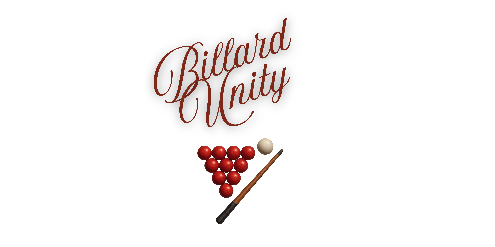

<p align="center">
  
</p>

**Simulación interactiva de billar en 3D, desarrollada en Unity, con físicas realistas, control de taco, UI personalizada y efectos de sonido.**

> ⚙️ _Requiere Unity versión **2022.3.62f1**_

---

<p align="center">
  
</p>

---

<h2 align="center">🚀 Tecnologías utilizadas</h2>

<p align="center">
  <table>
    <tr>
      <th>Tecnología</th>
      <th>Icono</th>
    </tr>
    <tr>
      <td>Unity 3D</td>
      <td></td>
    </tr>
    <tr>
      <td>C#</td>
      <td></td>
    </tr>
    <tr>
      <td>WebGL (futura demo)</td>
      <td></td>
    </tr>
    <tr>
      <td>Diseño UI personalizado</td>
      <td>🎨</td>
    </tr>
    <tr>
      <td>Físicas y colisiones</td>
      <td>🎱</td>
    </tr>
  </table>
</p>

## 🎮 Demo en vivo

👉 [Descargar y jugar ahora (.EXE)](https://LINK-A-TU-GOOGLE-DRIVE-O-ITCHIO)

---

## 📦 Cómo clonar y ejecutar

```bash
git clone https://github.com/ignnaaroans95/billar3dunity.git
