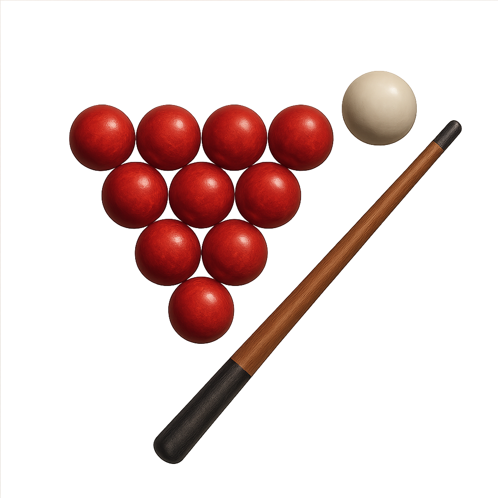

<h1>
  
  Billar 3D Unity
</h1>

**Simulación interactiva de billar en 3D, desarrollada en Unity, con físicas realistas, control de taco, UI personalizada y efectos de sonido.**

---

[](https://LINK-A-TU-GOOGLE-DRIVE-O-ITCHIO)

---

## 🛠️ Tecnologías

- Unity 3D
- C#
- WebGL (para futura demo online)
- Diseño de UI personalizado
- Físicas y colisiones realistas

---

## 🎮 Demo en vivo

👉 [Descargar y jugar ahora (.EXE)](https://LINK-A-TU-GOOGLE-DRIVE-O-ITCHIO)

---

## 📦 Cómo clonar y ejecutar

```bash
git clone https://github.com/ignnaaroans95/billar3dunity.git
